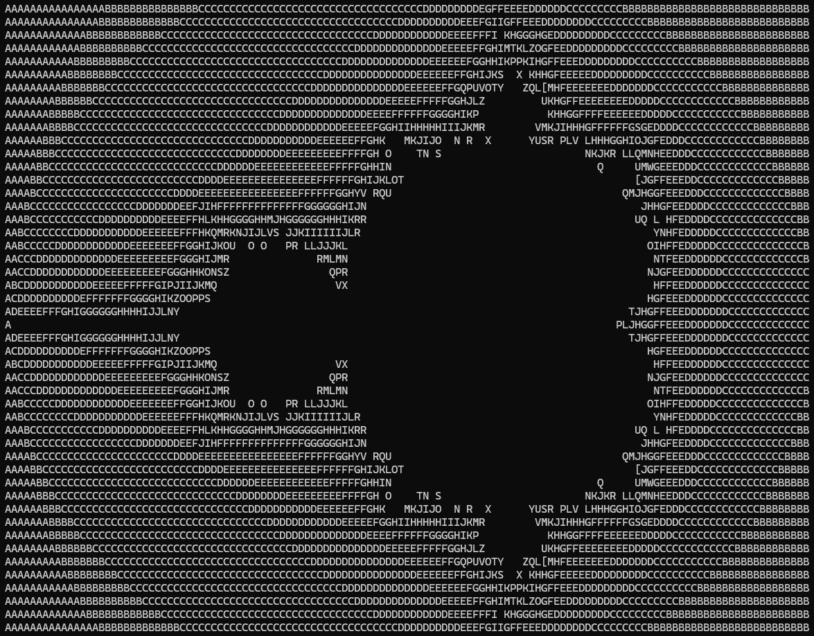

# Brainheck

Tiny [Brainf**k][1] interpreter in under 70 lines of portable C99 code.

## Background

Brainf**k is an extremely minimalistic esoteric programming language designed by Urban Müller in 1993. It is notorious
for being difficult to both read and write despite being very simple. It is also a Turing-complete language, meaning it
can be used to, simply speaking, perform any possible computation.

A Brainf**k program is an ordered sequence of _commands_, each encoded by a single character. The commands can read and
write memory from an array of at least 30,000 byte cells initially set to zero, but only one cell at a time. The cell
which the program can currently access is controlled by the _data pointer_, and the command being executed is set by the
_instruction pointer_. Basic I/O is performed through the data pointer, and the execution flow can be controlled using
only conditional jumps of the instruction pointer.

Altogether, the language itself consists of only eight commands:

| Character | Description                                                                                   |
|:---------:|-----------------------------------------------------------------------------------------------|
|    `>`    | Increment the data pointer (i.e., move to the cell to the right).                             |
|    `<`    | Decrement the data pointer (i.e., move to the cell to the left).                              |
|    `+`    | Increment the byte at the data pointer.                                                       |
|    `-`    | Decrement the byte at the data pointer.                                                       |
|    `.`    | Output the byte at the data pointer.                                                          |
|    `,`    | Accept one byte of input, storing its value at the data pointer.                              |
|    `[`    | If the byte at the data pointer is zero, jump forward to the command after the matching `]`.  |
|    `]`    | If the byte at the data pointer is non-zero, jump back to the command after the matching `[`. |

## Motivation

There isn't much use for a yet another Brainf**k interpreter as the language itself was deliberately designed to be
entirely pointless. I only made this implementation for a little fun in under an hour while configuring my development
environment. The interpreter is compliant with the language specification and can execute even complex programs, but it
is intentionally simplistic and naïve, as is evident by the lack of error handling and memory safety. I aimed at making
a succinct and (subjectively) elegant implementation, and I'm quite satisfied with the result. Maybe you will find this
pleasing, too!

## Demonstration

The [mandelbrot.bf](./mandelbrot.bf) program contains a copy of the [Mandelbrot set][2] viewer created by Erik Bosman,
and is broadly considered to be one of the most challenging programs to execute for a  Brainf**k interpreter. Below, you
may find a screenshot of the program's output produced by Brainheck. The interpreter was also tested against various
other [sample programs][3] which may be found online, including Sierpinski triangles, a playable Tic-Tac-Toe, and even a
universal Turing machine simulator.

## License
MIT, Copyright © 2021, Daniils Buts

[1]: <https://en.wikipedia.org/wiki/Brainfuck>
[2]: <https://en.wikipedia.org/wiki/Mandelbrot_set>
[3]: <https://brainfuck.org/>
